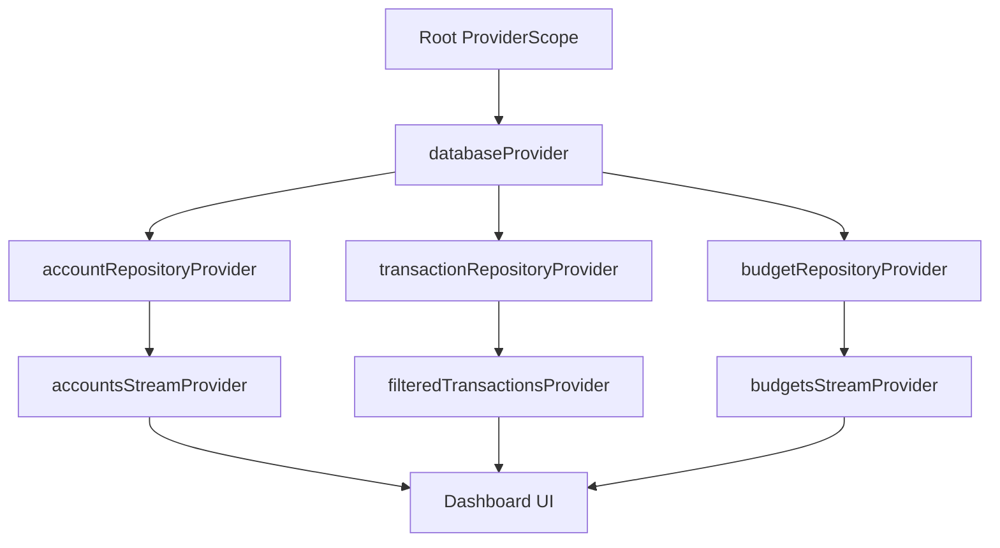

# System Architecture & Technical Design Document (SATD)
## Monetra — Personal Finance Workspace
**Tagline:** Offline. Private. Yours.  
**Version:** 1.0.0-SATD  
**Status:** Architecture Blueprint  
**Author:** Chief Software Architect & Open Source Engineering Council  

---

## 1. High-Level Architecture

Monetra employs strict **Clean Architecture** organized within a **Feature-First** topology. The system is divided into five concentric layers with absolute dependency inversion targeting the Domain core.

```text
+-----------------------------------------------------------------------+
|                         Presentation Layer                            |
|             (Flutter Widgets, Screens, Controllers, Themes)           |
+-----------------------------------------------------------------------+
                                   | (depends on)
                                   v
+-----------------------------------------------------------------------+
|                         Application Layer                             |
|          (Riverpod Providers, Use Cases, Commands, Queries)           |
+-----------------------------------------------------------------------+
                                   | (depends on)
                                   v
+-----------------------------------------------------------------------+
|                           Domain Layer                                |
|        (Entities, Value Objects, Domain Exceptions, Interfaces)        |
+-----------------------------------------------------------------------+
                                   ^
                                   | (implements interfaces)
+-----------------------------------------------------------------------+
|                            Data Layer                                 |
|       (Repository Implementations, Drift DAOs, Data Mappers)          |
+-----------------------------------------------------------------------+
                                   | (depends on)
                                   v
+-----------------------------------------------------------------------+
|                       Infrastructure Layer                            |
|        (SQLite/Drift Engine, Secure Storage, Local File System)       |
+-----------------------------------------------------------------------+
```

### 1.1 Layer Responsibilities & Dependency Rules
- **Domain Layer**: The innermost ring containing pure business entities, value objects, and repository contracts. Contains zero framework code (No Flutter, No Drift, No HTTP).
- **Application Layer**: Orchestrates domain use cases, manages UI state via Riverpod providers, and translates user actions into business commands.
- **Presentation Layer**: Consists of declarative UI widgets, custom canvas painters, reactive view logic, and responsive layouts. Interacts only with the Application and Domain layers.
- **Data Layer**: Implements repository interfaces defined in the Domain layer. Maps raw database rows into domain entities and manages data persistence.
- **Infrastructure Layer**: Low-level platform wrappers accessing hardware security enclaves, local file storage, and OS SQLite binaries.

---

## 2. Project Structure Specification

```text
monetra/
├── assets/                   # Static icons, default sample databases, schemas
│   ├── icons/
│   └── schemas/
├── docs/                     # SRS, SATD, and Architectural Decision Records
│   ├── SRS.md
│   └── SATD.md
├── lib/
│   ├── core/                 # Shared cross-cutting infrastructure & abstractions
│   │   ├── constants/        # Currencies, defaults, global limits
│   │   ├── database/         # Drift DB handle, connections, migrations, DAOs
│   │   ├── domain/           # Core domain entities, value objects, interfaces
│   │   ├── errors/           # Failure & exception taxonomy
│   │   ├── network/          # Local socket abstractions (sync read/write)
│   │   ├── providers/        # Core Riverpod providers (DB, storage, settings)
│   │   ├── security/         # Biometrics, PIN derivation, SQLCipher key hooks
│   │   ├── theme/            # Design tokens, color palette, ThemeData builders
│   │   ├── utils/            # Currency formatters, date utilities, UUID generator
│   │   └── widgets/          # Atomic reusable UI components (Cards, Inputs, Charts)
│   ├── features/             # Isolated feature modules
│   │   ├── accounts/
│   │   ├── analytics/
│   │   ├── budgets/
│   │   ├── categories/
│   │   ├── dashboard/
│   │   ├── goals/
│   │   ├── settings/
│   │   └── transactions/
│   ├── l10n/                 # Localization ARB files
│   └── main.dart             # Application boostrap and Root ProviderScope
├── test/                     # Unit, DAO, and Provider tests mirroring lib/
└── integration_test/         # End-to-end integration workflows
```

---

## 3. Feature Module Architecture

Each feature inside `lib/features/` is fully encapsulated:

```text
features/transactions/
├── presentation/             # UI elements
│   ├── controllers/          # Riverpod StateNotifier / Notifier instances
│   ├── pages/                # Screen views (TransactionsPage)
│   └── widgets/              # Feature-specific components (TransactionRow, EditorDialog)
├── application/              # Use cases & workflow handlers
│   ├── commands/             # CreateTransactionCommand, DeleteTransactionCommand
│   └── queries/              # GetFilteredLedgerQuery
├── domain/                   # Feature domain extensions (if non-core)
│   ├── models/
│   └── services/
└── data/                     # Feature data mappers & local DAOs
    └── repositories/
```

### 3.1 Feature Communication Rules
- Features **MUST NOT** directly import files from inside another feature's private subfolders.
- Cross-feature communication is facilitated exclusively through `core/domain/` interfaces and shared Riverpod providers in `core/providers/`.

---

## 4. Dependency Injection Architecture

Dependency Injection in Monetra is achieved using **Riverpod's compile-time graph resolution** without reflection (`get_it` or `injectable`).



### 4.1 Injection Lifecycle Management
- **Singletons**: Core database handles (`databaseProvider`), secure storage instances, and repository implementations are registered as permanent top-level `Provider` singletons.
- **Factory / AutoDispose Notifiers**: Transient UI state controllers use `autoDispose` to release resources when widgets unmount.
- **Lazy Initialization**: Database connections and repository stream instances are initialized lazily upon first provider read/watch call.

---

## 5. State Management Architecture (Riverpod)

### 5.1 Provider Selection Guidelines
- `Provider<T>`: Read-only dependency injection (e.g., repositories, formatters).
- `StateNotifierProvider` / `NotifierProvider`: Complex state objects requiring explicit mutation methods (e.g., `SettingsNotifier`).
- `StreamProvider<T>`: Reactive DB streams (e.g., `watchAllTransactions()`).
- `Provider.family`: Parameterized computations (e.g., `accountBalanceByIdProvider(id)`).

### 5.2 Optimistic UI Updates & Invalidation
```mermaid
sequenceDiagram
    participant UI as Flutter Widget
    participant N as TransactionNotifier
    participant R as TransactionRepository
    participant DB as SQLite / Drift DB
    
    UI->>N: createTransaction(newTx)
    N->>N: Optimistically update local UI state list
    N-->>UI: Render newTx immediately (0ms delay)
    N->>R: persistTransaction(newTx)
    alt Success
        R->>DB: INSERT into transactions
        DB-->>R: Ack
        R-->>N: Stream emits canonical DB record
    alt Failure
        R-->>N: Throw DatabaseException
        N->>N: Rollback optimistic UI state list
        N-->>UI: Display Error Toast & restore UI
    end
```

---

## 6. Navigation & Routing Architecture

### 6.1 Workspace Navigation Shell
Monetra uses a declarative workspace navigation shell.
- **Desktop Layout**: Permanent Left Sidebar Navigation Rail + Main View Area (`IndexedStack`).
- **Mobile Layout**: Bottom Navigation Bar + Full-screen Modal Route Stack.

### 6.2 Route Guards & State Preservation
- **Authentication Guard**: Intercepts tab switching if Security PIN / Biometric Vault lock is active.
- **State Preservation**: `IndexedStack` maintains scroll offsets and active search filter inputs across tab switches without destroying widget subtrees.

---

## 7. Repository Architecture

Repositories abstract raw SQLite data tables into pure domain models.

### 7.1 Interface Contract Pattern
```text
                  +--------------------------------+
                  |  ITransactionRepository (Core) |
                  +--------------------------------+
                                  ^
                                  | (implements)
                  +--------------------------------+
                  |  TransactionRepositoryImpl     |
                  +--------------------------------+
                                  |
               +------------------+------------------+
               v                                     v
    +--------------------+                 +--------------------+
    | Drift SQLite DAO   |                 | In-Memory Test DAO |
    +--------------------+                 +--------------------+
```

### 7.2 Transactional Guarantees
Operations mutating multiple tables (e.g., Transfer transaction updating Source Account, Destination Account, and Transaction Ledger) run inside an explicit SQLite `db.transaction()` block. If any step fails, the entire transaction rolls back automatically.

---

## 8. Database Architecture (Drift + SQLite)

### 8.1 SQLite Configuration Parameters
- **Journal Mode**: `WAL` (Write-Ahead Logging) for concurrent read access during background write operations.
- **Synchronous Flag**: `NORMAL` (Optimal balance between disk I/O performance and data safety).
- **Foreign Keys**: `PRAGMA foreign_keys = ON;` strictly enforced.

### 8.2 Schema Versioning & Migration Strategy
- Migration steps managed via Drift's `MigrationStrategy`.
- Every migration step includes automated schema validation scripts tested in CI.
- Schema migrations run inside database transaction locks before UI startup completes.

---

## 9. Domain Layer Design

### 9.1 DDD Principles Applied
- **Entities**: Objects possessing unique identity (`Account`, `TransactionEntity`, `Category`, `Budget`).
- **Value Objects**: Immutable domain objects identified solely by attributes (e.g., `Money(amount, currency)`, `DateRange(start, end)`).
- **Domain Services**: Business calculations transcending single entities (e.g., `SpendingVelocityService`).

### 9.2 Validation Rules
Domain objects validate invariants upon instantiation. Creating a `TransactionEntity` with an empty account ID or an invalid date throws a `DomainValidationException` instantly.

---

## 10. Application Layer Architecture

### 10.1 Command Query Responsibility Segregation (CQRS) Light
- **Commands**: State-altering operations (`CreateTransactionCommand`, `ArchiveAccountCommand`). Returns `Future<Result<void, Failure>>`.
- **Queries**: Read-only stream subscriptions (`WatchFilteredTransactionsQuery`). Returns `Stream<List<TransactionEntity>>`.

### 10.2 Error Propagation Model
Failures are captured using typed `Result<Success, Failure>` domain classes, avoiding uncaught runtime exceptions in UI widget trees.

---

## 11. Presentation Layer Architecture

### 11.1 Responsive View Layouts
- **Widescreen Desktop (>900px)**: Multi-column split view (Sidebar + Workspace Ledger + Detail Inspector Pane).
- **Compact Mobile (<900px)**: Single column adaptive view with bottom sheet details.

### 11.2 Rebuild Optimization Strategy
- Widgets consume granular Riverpod `ref.watch(provider.select((s) => s.property))` selectors to ensure widget rebuilds occur ONLY when the watched property changes.

---

## 12. Shared Infrastructure Components

- **MonetraCard**: Glassmorphic / flat container with customizable border opacity.
- **StatCard**: Metric indicator card with icon badge and status trend.
- **MonetraChart**: Custom canvas line chart painter with smooth cubic spline interpolation and gradient fill.
- **TransactionEditorDialog**: Multi-type modal transaction form.

---

## 13. Design Token System

### 13.1 Token Definitions

| Token Category | Value Scale |
| :--- | :--- |
| **Spacing** | $4\text{px}, 8\text{px}, 12\text{px}, 16\text{px}, 24\text{px}, 32\text{px}, 48\text{px}$ |
| **Border Radius** | $4\text{px}, 8\text{px}, 12\text{px}, 16\text{px}, 24\text{px}$ (User Customizable) |
| **Typography** | Display (32px/Bold), Title (18px/SemiBold), Body (14px/Regular), Caption (11px/Medium) |
| **Animation Speeds**| Fast ($150\text{ms}$), Standard ($250\text{ms}$), Slow ($400\text{ms}$) |

### 13.2 Theme Palette Injection
`MonetraColors` maps HSL color vectors dynamically, allowing immediate runtime updating of dark mode, light mode, OLED pitch black mode, and accent hues without app restarts.

---

## 14. Transaction Lifecycle & Data Flow

```text
[User taps "Save Transaction"]
              │
              ▼
[TransactionEditorDialog (Presentation)]
              │ (validates form input)
              ▼
[CreateTransactionCommand (Application)]
              │ (constructs TransactionEntity)
              ▼
[ITransactionRepository (Domain Interface)]
              │ (invokes persist)
              ▼
[TransactionRepositoryImpl (Data Layer)]
              │ (opens SQLite transaction)
              ▼
[Drift DB Engine / SQLite WAL]
              │ (persists row & updates indexes)
              ▼
[Reactive DB Table Stream Trigger]
              │ (emits updated list)
              ▼
[transactionsStreamProvider (Riverpod)]
              │ (recomputes selectors)
              ▼
[DashboardPage / TransactionsPage (UI)]
              │ (re-renders diffed UI elements)
              ▼
[Net Worth StatCard & Ledger View Updated]
```

---

## 15. Event Architecture & Propagation

Monetra uses a lightweight in-process event bus for decoupled cross-feature notifications:
- **System Events**: `TransactionCreatedEvent`, `CategoryDeletedEvent`, `ThemeChangedEvent`, `BackupRestoredEvent`.
- **Handling**: Features register listeners on `eventBusProvider` without introducing direct compile-time class dependencies on each other.

---

## 16. Caching Strategy

- **Level 1 (Memory Cache)**: Active accounts, categories, and theme settings retained in Riverpod provider memory for $0\text{ms}$ access.
- **Level 2 (Indexed DB Cache)**: Historical transactions queried from SQLite WAL memory pages.
- **Cache Invalidation**: Invalidated automatically via Drift reactive stream triggers upon write mutations.

---

## 17. Search Architecture Specification

- **Engine**: SQLite FTS5 Full-Text Search.
- **Index Definition**: Virtual table over `description`, `notes`, `tags`.
- **Query Ranking**: `bm25(fts_table)` ranking algorithm prioritizes exact description matches over tag matches.
- **Latency Target**: $<30\text{ms}$ query turnaround for $100,000$ rows.

---

## 18. Synchronization Architecture (Future-Proofing)

### 18.1 Deterministic Conflict Resolution (CRDT-Inspired)

```text
Incoming Remote Delta Payload
              │
              ▼
[Compare UUID Primary Keys]
   ├── New UUID ──────> Insert Record
   └── Existing UUID ──> Compare Version Counter
                            ├── Remote Version > Local Version ──> Apply Remote Update
                            ├── Remote Version < Local Version ──> Keep Local Record
                            └── Version Match ───────────────> Tiebreaker: Max(updated_at UTC)
```

- **Soft Delete Tombstones**: Deleted items persist with `is_deleted = 1` and `updated_at = timestamp` for 90 days to guarantee sync deletion propagation.

---

## 19. Plugin Architecture Specification

```text
+-------------------------------------------------------------------+
|                        Monetra Host Core                          |
+-------------------------------------------------------------------+
                                  │
                       Plugin Boundary Interface
                                  │
       ┌──────────────────────────┼──────────────────────────┐
       ▼                          ▼                          ▼
[Import Plugins]           [Export Plugins]           [Analytics Plugins]
(OFX / QIF Parsers)       (PDF / CSV / Tax)          (Custom Visual Graphs)
```

- **Isolation**: Plugins execute within sandboxed Dart isolates with read-only entity streams.
- **Security**: Plugins require explicit user permissions granted via settings UI to access export APIs.

---

## 20. Security Architecture

- **Database Encryption**: SQLCipher AES-256 transparent database encryption key derived using PBKDF2 (100,000 iterations).
- **Key Storage**: Encryption master keys stored securely in native platform hardware enclaves (`flutter_secure_storage` / Keychain / Keystore / Secret Service).
- **Biometric Gatekeeping**: Local authentication check triggered on app launch and resume.

---

## 21. Performance Architecture & Benchmarks

- **Virtualization**: All ledger lists rendered via `ListView.builder` / `SliverList` virtualized viewports (only visible rows allocated in memory).
- **Image & Icon Optimization**: Material Vector Icons used exclusively to avoid raster memory overhead.
- **Frame Budget**: Widget build phases capped under $8.3\text{ms}$ to ensure steady 120 FPS performance on supported displays.

---

## 22. Centralized Error Handling System

```text
Exceptions (DB / Format / Validation)
              │
              ▼
[Global Error Boundary Handler]
              │
    ┌─────────┴─────────┐
    ▼                   ▼
[Domain Failure]   [System Crash Log]
    │                   │
    ▼                   ▼
[User UI Toast]    [Masked Local Log File]
```

- **Zero Silent Failures**: Every failure produces a user-understandable notification toast or inline state banner.

---

## 23. Testing Architecture & Pipeline

- **Unit Tests**: Test domain entity mutations, repository implementation methods, and calculation logic.
- **Widget Tests**: Test declarative screen UI rendering, drawer navigation, and modal forms.
- **Integration Tests**: Execute real end-to-end user workflows using real SQLite database instances.
- **Target Coverage**: $85\%+$ statement coverage on Domain, Data, and Application layers.

---

## 24. Open Source Architecture & Community Standards

- **Code Style**: Enforced via `flutter_lints` with zero warnings permitted in CI builds.
- **Documentation**: All public classes, interfaces, and methods require dartdoc comments.
- **PR Process**: Feature branch $\rightarrow$ Automated CI matrix check (lint + test) $\rightarrow$ Code review by 2 maintainers $\rightarrow$ Merge commit to `develop`.

---

## 25. Architectural Decision Records (ADR)

### ADR-01: Feature-First Clean Architecture Topology
- **Problem**: Need an architecture supporting both modular open-source community contributions and strict separation of concerns.
- **Chosen Solution**: Feature-First Clean Architecture (`lib/core/` for shared infrastructure, `lib/features/` for isolated functional domain modules).
- **Advantages**: Easy for new open-source contributors to locate specific feature code without touching core infrastructure.
- **Trade-offs**: Slightly higher initial folder structure boilerplate.

### ADR-02: Riverpod for Application State Management & DI
- **Problem**: Need predictable, performant, compile-safe state management without reliance on global singletons or context-bound providers.
- **Chosen Solution**: Flutter Riverpod v2.
- **Advantages**: Compile-time safety, zero reflection, auto-dispose capabilities, and built-in reactive stream providers matching Drift DB streams.
- **Trade-offs**: Learning curve for new contributors unfamiliar with provider scope selectors.

### ADR-03: Drift (SQLite) as Core Local Persistence Engine
- **Problem**: Need type-safe, performant, ACID-compliant local database supporting FTS5 full-text search, reactive streams, and future SQLCipher encryption.
- **Chosen Solution**: Drift ORM over SQLite.
- **Advantages**: Type-safe Dart table definitions, reactive stream query capabilities, automatic migration generation, and excellent cross-platform support.
- **Trade-offs**: Code generation step (`build_runner`) required during development build workflows.
