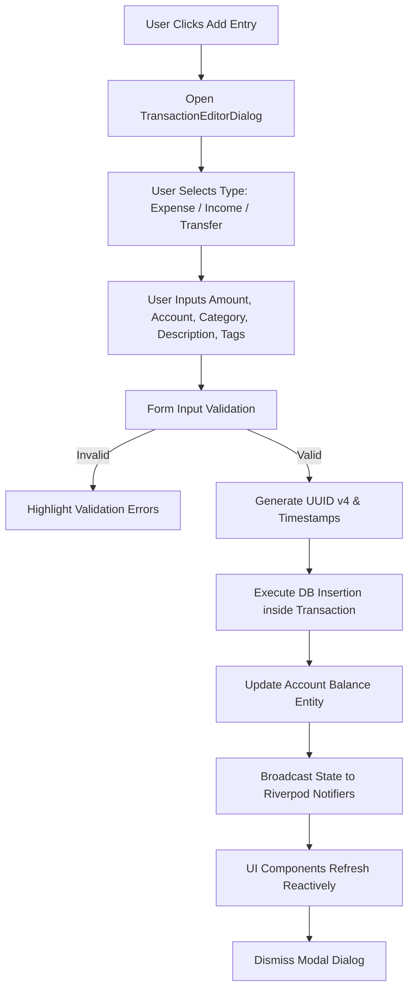
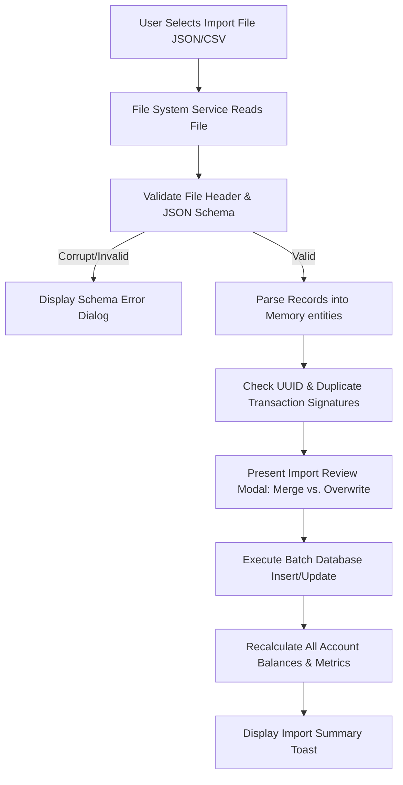

# Software Requirements Specification (SRS)
## Monetra — Personal Finance Workspace
**Tagline:** Offline. Private. Yours.  
**Version:** 1.0.0-SRS  
**Status:** Approved Specification  
**Author:** Lead Software Architect & Technical Steering Committee  

---

## 1. Executive Summary

### 1.1 Project Vision
Monetra is a modern, open-source, offline-first, privacy-first Personal Finance Workspace built with Flutter. It is designed to serve as a comprehensive control center for an individual's complete financial lifecycle without depending on external cloud services, proprietary subscriptions, dark-pattern advertising, or third-party banking integrations.

### 1.2 Mission
To empower individuals worldwide with full digital sovereignty over their personal financial data through software that is transparent, permanent, visually delightful, highly performant, and maintained by an open-source community.

### 1.3 Core Goals
1. **Zero Egress by Default**: All user financial records, account details, categories, analytics, and preferences remain strictly on the user's physical device.
2. **Lifetime Utility**: Operate seamlessly for decades without requiring API key maintenance, vendor server access, or external infrastructure.
3. **High-Scale Performance**: Maintain 60 FPS UI rendering and sub-50ms query responses with over 100,000 transaction records.
4. **Deep Customization**: Provide an adaptable workspace UI where layout, theme, typography, density, and charts reflect user preference.
5. **Open Data Ownership**: Native 1-click import and export in open human-readable formats (JSON, CSV).

### 1.4 Target Audience
- **Privacy-Conscious Individuals**: Users who refuse to transmit sensitive financial records to third-party fintech platforms or cloud servers.
- **Digital Nomads & Global Citizens**: Users managing multi-currency accounts across multiple jurisdictions without reliable internet access.
- **Open-Source Enthusiasts & Developers**: Community members seeking an extensible, clean codebase to audit, modify, and maintain.
- **Power Budgeters & Financial Planners**: Users requiring detailed historical ledger filtering, category taxonomies, and velocity metrics.

### 1.5 Problems Monetra Solves
- **Subscription Fatigue & App Sunset Risk**: Eliminates monthly fees and app shutdowns caused by fintech acquisitions.
- **Data Harvesters**: Eliminates monetization of user financial transactions for targeted ads or credit scoring.
- **Connectivity Dependency**: Works in flight mode, remote areas, or network outages without feature degradation.
- **Vendor Lock-in**: Prevents data entrapment by facilitating raw data export and database migration tools.

### 1.6 Project Philosophy & Core Values
- **Privacy First**: Financial data belongs solely to the user.
- **Offline First**: Network availability is never assumed.
- **Open Source**: Code transparency guarantees security and longevity.
- **No Ads, No Subscriptions, No Mandatory Accounts**: Zero monetized friction.
- **Performance Before Complexity**: Prefer lightweight, optimized algorithms over heavy external frameworks.
- **Accessibility by Default**: Designed for all visual, motor, and cognitive capabilities.

### 1.7 Success Criteria
- **User Trust**: Zero unapproved outbound network requests.
- **Performance**: Cold boot time under 1.2 seconds; transaction search latency under 30ms for 100,000 items.
- **Community Adoption**: Active contributor participation with modular architecture enabling clean pull requests.

---

## 2. Functional Requirements

### 2.1 Workspace Dashboard
- **2.1.1 Purpose**: Serve as the high-level financial command center summarizing real-time net worth, month-to-date income/expenses, budget health, and recent ledger activity.
- **2.1.2 User Interaction**: Interactive metric cards, quick transaction trigger button, range selector for net worth graphs (30-day, YTD, All-time).
- **2.1.3 Business Rules**:
  - Net worth equals sum of active asset account balances minus liability account balances.
  - Exclude soft-deleted records (`is_deleted = true`) from all calculations.
- **2.1.4 Dependencies**: Account Repository, Transaction Repository, Budget Repository.
- **2.1.5 Edge Cases**: Zero accounts configured; all accounts archived; negative overall net worth.
- **2.1.6 Future Extensibility**: Customizable drag-and-drop dashboard widget grid.

### 2.2 Transaction Ledger
- **2.2.1 Purpose**: Record, classify, search, and manage all income, expense, and transfer records.
- **2.2.2 User Interaction**: Infinite scroll virtualized ledger, multi-field search bar, inline tag filter pills, swipe-to-delete, modal editor.
- **2.2.3 Business Rules**:
  - Expense transactions subtract from account balance; income adds to account balance.
  - Transfers decrease source account balance and increase destination account balance without altering total net worth.
  - Every transaction must maintain immutable creation timestamp and incremental version counter.
- **2.2.4 Dependencies**: Account Repository, Category Repository.
- **2.2.5 Edge Cases**: Split transactions across categories; multi-currency transfers; future-dated transactions.
- **2.2.6 Future Extensibility**: Automated receipt image attachment association stored locally.

### 2.3 Account Management
- **2.3.1 Purpose**: Manage checking accounts, savings vaults, credit cards, cash wallets, and investment holdings.
- **2.3.2 User Interaction**: Card grid view, account archive toggle, balance manual override, currency selector.
- **2.3.3 Business Rules**:
  - Account types determine asset vs. liability classification.
  - Deleting an account soft-deletes associated transactions or prompts for account reassignment.
- **2.3.4 Dependencies**: Database schema, Currency Formatter Service.
- **2.3.5 Edge Cases**: Multi-currency account balance conversion; negative cash balances.
- **2.3.6 Future Extensibility**: Sub-account grouping and asset class allocation breakdown.

### 2.4 Categories & Taxonomies
- **2.4.1 Purpose**: Organize financial activities into hierarchical income, expense, and transfer types.
- **2.4.2 User Interaction**: Nested tree view, color picker, icon picker, parent-child assignment.
- **2.4.3 Business Rules**:
  - Sub-categories inherit parent category properties unless explicitly overridden.
  - Deleting a parent category offers options to reassign child items or collapse hierarchy.
- **2.4.4 Dependencies**: Icon Helper, Color Palette Engine.
- **2.4.5 Edge Cases**: Circular parent-child hierarchy references; orphan categories.
- **2.4.6 Future Extensibility**: Dynamic category rules engine based on merchant string matching.

### 2.5 Budgets & Spending Velocity
- **2.5.1 Purpose**: Track category spending caps and calculate daily burn velocity to prevent overspending.
- **2.5.2 User Interaction**: Visual progress bars, color-coded velocity alerts (Green/Amber/Red), period selector (Monthly/Yearly/Custom).
- **2.5.3 Business Rules**:
  - Velocity calculated as `(Current Spent / Days Elapsed) vs. (Total Budget / Total Days)`.
  - Unused budget roll-over can be enabled per category.
- **2.5.4 Dependencies**: Transaction Repository, Category Repository.
- **2.5.5 Edge Cases**: Leap years; mid-month budget creation; zero spending limit.
- **2.5.6 Future Extensibility**: Dynamic seasonal budget curve adjustments.

### 2.6 Financial Goals
- **2.6.1 Purpose**: Assist users in saving for target purchases, emergency funds, or debt payoff milestones.
- **2.6.2 User Interaction**: Milestone progress rings, estimated completion date projection, automated savings allocation rules.
- **2.6.3 Business Rules**: Goal contributions can be linked directly to specific account balances or tag allocations.
- **2.6.4 Dependencies**: Account Repository.
- **2.6.5 Edge Cases**: Goal target amount decreased below current progress; linked account balance drops.
- **2.6.6 Future Extensibility**: Automated smart allocation recommendations based on surplus income.

### 2.7 Analytics & Custom Reports
- **2.7.1 Purpose**: Provide cashflow visual breakdowns, category pie charts, income vs. expense comparisons, and exportable summary tables.
- **2.7.2 User Interaction**: Date range picker, interactive slice inspection, export PDF/CSV report.
- **2.7.3 Business Rules**: Exclude internal account transfers from income vs. expense totals to avoid double counting.
- **2.7.4 Dependencies**: Canvas Chart Painter, Data Export Engine.
- **2.7.5 Edge Cases**: Single transaction within range; zero income period.
- **2.7.6 Future Extensibility**: Custom SQL-like visual query builder for advanced analytics.

### 2.8 Local Import & Export
- **2.8.1 Purpose**: Enable full data portability into open JSON and CSV formats.
- **2.8.2 User Interaction**: Export button with password encryption option; drag-and-drop import validator dialog.
- **2.8.3 Business Rules**:
  - Import process validates schema version, checks UUID collisions, and offers Merge or Overwrite modes.
  - Invalid records must produce line-by-line error reports without corrupting local state.
- **2.8.4 Dependencies**: File System Service, Serialization Engine.
- **2.8.5 Edge Cases**: Large CSV import (>50k rows); malformed date strings; missing headers.
- **2.8.6 Future Extensibility**: Direct import parsers for standard bank export formats (OFX, QIF, CAMT.053).

### 2.9 Customization System
- **2.9.1 Purpose**: Allow complete personalization of themes, accent colors, typography, density, and layout.
- **2.9.2 User Interaction**: Theme mode radio (Light/Dark/OLED), hex accent color picker, corner radius slider, font family dropdown.
- **2.9.3 Business Rules**: Customization state persists locally in key-value store and broadcasts instantly to UI.
- **2.9.4 Dependencies**: Settings Repository, Theme Engine.
- **2.9.5 Edge Cases**: Contrast ratio falling below WCAG AA thresholds on custom color selection.
- **2.9.6 Future Extensibility**: Community CSS/JSON theme file sharing.

### 2.10 Security & Data Vault
- **2.10.1 Purpose**: Safeguard offline database with SQLCipher encryption, biometric unlock, and auto-lock timers.
- **2.10.2 User Interaction**: PIN setup prompt, fingerprint/FaceID authentication dialog, auto-lock duration dropdown.
- **2.10.3 Business Rules**: Encryption key generated via PBKDF2 with 100,000 iterations stored securely in system hardware keychain.
- **2.10.4 Dependencies**: Local Auth, Secure Storage.
- **2.10.5 Edge Cases**: Biometric hardware failure; repeated failed PIN attempts (exponential backoff delay).
- **2.10.6 Future Extensibility**: Multi-vault support with plausible deniability duress PIN.

---

## 3. Non-Functional Requirements

### 3.1 Performance
- **Cold Boot Time**: Under 1.2 seconds on mid-tier hardware.
- **UI Responsiveness**: Constant 60 FPS (120 FPS on supported high-refresh screens) during scrolling and animations.
- **Database Query Latency**: Sub-30ms execution time for full-text search across 100,000 records.

### 3.2 Reliability & Fault Tolerance
- **ACID Compliance**: All database mutations execute inside SQLite transactions.
- **Crash Prevention**: Zero unhandled exceptions in UI render loops; robust fallback states for corrupt preference keys.
- **Data Integrity**: WAL (Write-Ahead Logging) mode enabled to prevent database corruption on abrupt process termination.

### 3.3 Maintainability & Clean Architecture
- Strict separation between Domain, Data, Application, and Presentation layers.
- Code coverage baseline: Minimum 85% for domain and data repositories.
- Zero cyclic package dependencies.

### 3.4 Scalability
- Support database storage scaling up to 1,000,000 transactions without schema redesign or UI virtualization collapse.
- Memory usage capped below 150 MB under heavy usage.

### 3.5 Privacy & Security
- Zero network socket initialization for telemetry, analytics, or remote tracking.
- Sensitive values masked in system crash logs and process dumps.

### 3.6 Power & Resource Efficiency
- Minimal CPU wake cycles when idle.
- OLED theme mode utilizes true `#000000` pixels to minimize display battery drain on mobile/laptop screens.

---

## 4. User Personas

### Persona 1: Alex — The Privacy Purist
- **Background**: Senior Systems Administrator, 34 years old.
- **Goals**: Wants a centralized ledger for 5 accounts without exposing net worth to cloud aggregators or third-party servers.
- **Pain Points**: Frustrated by fintech apps adding social feeds, crypto ads, and mandatory online logins.
- **Primary Workflows**: Manual entry after purchases, weekly JSON backup to offline NAS, custom SQL export.
- **Usage Pattern**: Desktop workstation access 3x per week.

### Persona 2: Elena — The Digital Nomad
- **Background**: Freelance Graphic Designer, 29 years old.
- **Goals**: Track income and expenses in 4 different currencies (USD, EUR, GBP, IDR) while traveling through low-connectivity areas.
- **Pain Points**: Loss of app access when offline; incorrect currency conversions; cluttered complex interfaces.
- **Primary Workflows**: Quick mobile transaction entry, category budget tracking, currency exchange adjustments.
- **Usage Pattern**: Daily mobile access, high frequency quick entries.

### Persona 3: Marcus — The Financial Optimizer
- **Background**: Financial Analyst, 42 years old.
- **Goals**: Analyze spending velocity, forecast yearly savings goals, and evaluate asset class distribution.
- **Pain Points**: Lack of full-text search and tag filtering in traditional banking interfaces.
- **Primary Workflows**: Complex ledger queries, custom category rule creation, monthly CSV data export.
- **Usage Pattern**: Intensive monthly review sessions on widescreen desktop layout.

---

## 5. User Stories & Acceptance Criteria

### US-01: Quick Transaction Entry
- **As a** daily budgeter,
- **I want to** log a new transaction in under 5 seconds,
- **So that** I maintain an accurate expense record without disrupting my day.
- **Acceptance Criteria**:
  1. Triggering `Add Entry` opens modal editor immediately (<100ms).
  2. Account selection defaults to last used account.
  3. Form submits upon pressing `Enter` key or tapping primary action.
  4. Ledger and dashboard update reactively without requiring manual refresh.
- **Edge Cases**: Amount entered with 3+ decimal places auto-rounds to 2 places; empty description flags validation error.

### US-02: Instant Ledger Search & Filtering
- **As a** financial optimizer,
- **I want to** filter my transaction history by search term, category, and date range simultaneously,
- **So that** I can locate specific historical payments instantly.
- **Acceptance Criteria**:
  1. Typing in search bar updates results in real-time with zero search latency.
  2. Search matches against description, notes, and `#tags`.
  3. Category filter dropdown updates result set concurrently with search query.
  4. Clearing filters restores complete chronological ledger view.

### US-03: Local Backup Generation
- **As a** privacy-conscious user,
- **I want to** generate a human-readable JSON backup file on my local storage,
- **So that** I own my financial data independently of the software version.
- **Acceptance Criteria**:
  1. Clicking `Export JSON` prompts for local save destination.
  2. Export file contains complete schema: accounts, categories, transactions, budgets, settings.
  3. Export completes within 500ms for 10,000 transactions.
  4. Exported JSON strictly validates against public Monetra Schema v1.0.

---

## 6. Application Workflows

### 6.1 Transaction Creation Workflow


### 6.2 Data Import & Reconcile Workflow


---

## 7. Data Flow & Reactive State Architecture

### 7.1 Single Directional Data Flow (Unidirectional)
Data in Monetra moves in a strictly unidirectional loop:
1. **User Action / Event**: User interacts with UI component (e.g., adds transaction).
2. **Controller / Notifier Execution**: UI invokes method on Riverpod Notifier or Repository.
3. **Domain Entity Mutation**: Application validates entity constraints and constructs updated domain instance.
4. **Data Repository Persistence**: Repository persists changes to local SQLite database via Drift ORM.
5. **Reactive Broadcast**: Database stream trigger emits updated dataset to active Riverpod `StreamProviders`.
6. **UI Re-render**: Subscribed Flutter widgets re-render with optimal diffing.

### 7.2 Dynamic Event Propagation & Caching Strategy
- **In-Memory Cache**: Active accounts, categories, and settings are cached in memory via Riverpod providers for instant zero-latency UI access.
- **Stream Selectors**: UI components subscribe to narrowly scoped selectors (e.g., `monthToDateExpenseProvider`) to prevent whole-screen widget re-builds during localized ledger edits.

---

## 8. Synchronization Strategy (Future-Proof Architecture)

Although Monetra is offline-first, its data layer is designed for zero-conflict peer-to-peer or self-hosted cloud synchronization (Nextcloud, WebDAV, local network sync) without requiring architectural rewrites.

### 8.1 Source of Truth & Local Determinism
The local SQLite database is always the primary source of truth. Every transaction, account, and category mutation records a immutable client ID, UUID, UTC timestamp, and incremental `version` counter.

### 8.2 Conflict Detection & Vector Clocks
- **UUID Primary Keys**: Eliminates primary key auto-increment collisions across independent devices.
- **Deterministic Merge Rules**:
  - Higher `version` number takes precedence.
  - If `version` is identical, latest UTC `updated_at` timestamp resolves tie.
  - Soft-deleted items (`is_deleted = true`) maintain tombstones for 90 days to propagate deletions reliably across peers.

### 8.3 Incremental Sync Vector
Sync engines query records where `updated_at > last_sync_timestamp`, exchanging only changed records (delta payloads) in compressed JSON formats.

---

## 9. Database Requirements & Schema Design

### 9.1 Data Integrity Rules
- Every table MUST include `id` (TEXT UUID), `created_at` (INTEGER UTC ms), `updated_at` (INTEGER UTC ms), `version` (INTEGER), and `is_deleted` (INTEGER 0/1).
- All monetary amounts stored as 64-bit real numbers or scaled integer micro-units to guarantee precision.

### 9.2 Entity Relationship Diagram (Conceptual)

```text
+-------------------+        1:N        +-----------------------+
|  AccountsTable    |-------------------|  TransactionsTable    |
+-------------------+                   +-----------------------+
| PK id (UUID)      |                   | PK id (UUID)          |
|    name           |                   | FK account_id         |
|    type           |                   | FK dest_account_id    |
|    currency       |                   | FK category_id        |
|    balance        |                   |    amount             |
|    created_at     |                   |    date               |
|    updated_at     |                   |    description        |
|    version        |                   |    notes              |
|    is_deleted     |                   |    tags               |
+-------------------+                   |    created_at         |
                                        |    updated_at         |
+-------------------+        1:N        |    version            |
|  CategoriesTable  |-------------------|    is_deleted         |
+-------------------+                   +-----------------------+
| PK id (UUID)      |                               |
|    name           |                               | 1:N
|    type           |                   +-----------------------+
| FK parent_id      |                   |     BudgetsTable      |
|    icon           |                   +-----------------------+
|    color_hex      |                   | PK id (UUID)          |
|    created_at     |                   | FK category_id        |
|    updated_at     |                   |    amount             |
|    version        |                   |    period             |
|    is_deleted     |                   |    created_at         |
+-------------------+                   |    updated_at         |
                                        |    version            |
                                        |    is_deleted         |
                                        +-----------------------+
```

### 9.3 Database Indexing Strategy
To maintain sub-30ms performance over 100,000 records:
- `idx_transactions_date`: ON `TransactionsTable(date DESC)`.
- `idx_transactions_account`: ON `TransactionsTable(account_id)`.
- `idx_transactions_category`: ON `TransactionsTable(category_id)`.
- `idx_transactions_search`: Full-Text Search (FTS5) virtual table covering `description`, `notes`, `tags`.

---

## 10. Local Algorithms & Computation Engine

Monetra executes all financial calculations entirely on the local CPU without external services.

### 10.1 Spending Velocity & Burn Rate Algorithm
- **Formula**:
  $$\text{Daily Burn Rate} = \frac{\sum \text{Expenses in Period}}{\text{Days Elapsed}}$$
  $$\text{Projected Month End} = \text{Current Spent} + (\text{Daily Burn Rate} \times \text{Days Remaining})$$
- **Complexity**: $O(N)$ where $N$ is the number of transactions in current billing cycle.

### 10.2 Recurring Transaction Detection Algorithm
- **Purpose**: Detect periodic payments (subscriptions, utility bills, rent) automatically.
- **Logic**:
  1. Group non-deleted expense transactions by normalized description string.
  2. Compute interval variance between adjacent transaction dates.
  3. If variance is within $\pm 2$ days of 7, 14, 30, or 365 days across 3+ consecutive occurrences, flag as candidate subscription.
- **Complexity**: $O(N \log N)$ sorting + linear scan.

### 10.3 Net Worth Trajectory Interpolation
- **Purpose**: Render smooth historical net worth curves.
- **Logic**: Cubic Hermite Spline interpolation calculated over daily closing balance arrays.
- **Complexity**: $O(D)$ where $D$ is the number of days in selected chart window.

---

## 11. Search Architecture

### 11.1 Full-Text Search Engine (FTS5)
- SQLite FTS5 engine indexes transaction descriptions, notes, and comma-separated tags.
- Tokenizers: Porter stemmer + Unicode61 tokenizer for international character support.

### 11.2 Multi-Parameter Query Pipeline
Search queries combine full-text match clauses with indexed range filters:
$$\text{Query} = \text{FTSMatch}(\text{query}) \land (\text{category} = C) \land (\text{date} \ge T_{\text{start}}) \land (\text{date} \le T_{\text{end}})$$

### 11.3 Search History & Cache
Recent search tokens stored in local cache key `recent_searches` (max 10 items) for quick tap suggestions.

---

## 12. Design System Specification

### 12.1 Typography Hierarchy
Font Family: **Inter** (Primary), **JetBrains Mono** (Monetary Amounts & Code), **Outfit** (Headers).
- `Display Large`: 32px / Bold / Letter-spacing -0.8px
- `Title Medium`: 18px / SemiBold / Letter-spacing -0.4px
- `Body Medium`: 14px / Regular / Line-height 1.5
- `Caption`: 11px / Medium / Letter-spacing 0.2px

### 12.2 Color Tokens & Aesthetics
- **Dark Mode Background**: `#090D16` (Deep Obsidian Gray)
- **OLED Mode Background**: `#000000` (Pure Pitch Black)
- **Surface Elevation 1**: `#111827`
- **Surface Elevation 2**: `#1F2937`
- **Border Neutral**: `#374151`
- **Income Accent**: `#10B981` (Emerald Green)
- **Expense Accent**: `#EF4444` (Rose Red)
- **Transfer Accent**: `#3B82F6` (Electric Blue)

### 12.3 Elevation & Glassmorphic Surfaces
Cards utilize flat background fills with 1px semi-transparent borders (`BorderSide(color: border.withOpacity(0.4))`) instead of heavy drop shadows, maintaining modern Linear/Notion visual clarity.

---

## 13. Customization Engine

### 13.1 Dynamic Theme Provider
Allows real-time runtime injection of custom `ThemeData` parameters:
- Light / Dark / OLED mode switching.
- Primary Accent Hex override (Indigo, Emerald, Rose, Amber, Cyan, Purple).
- Global Corner Radius adjustment ($4\text{px} \rightarrow 24\text{px}$).

### 13.2 Layout Density & Font Scaling
Users can switch between `Compact` (reduced padding, smaller rows for high-density desktop views) and `Spacious` (touch-optimized mobile padding).

---

## 14. Security Model & Privacy Specification

### 14.1 Threat Model
- **Threat**: Physical device access by unauthorized third party.  
  **Mitigation**: SQLCipher AES-256 database encryption; biometric/PIN screen lock.
- **Threat**: Cold boot memory extraction.  
  **Mitigation**: Sensitive key buffers wiped from RAM upon application pause.
- **Threat**: Unintended cloud backup exfiltration (e.g., unencrypted OS backup).  
  **Mitigation**: Explicit configuration flag excluding database directory from OS default cloud backups.

### 14.2 Local Authentication Engine
- Biometric verification via `local_auth` native APIs (Fingerprint, FaceID, Windows Hello).
- PIN fallback using PBKDF2 key derivation.

---

## 15. Backup and Recovery

### 15.1 Backup Schema Format (Monetra JSON v1.0)
```json
{
  "format": "monetra_backup",
  "version": "1.0.0",
  "created_at": "2026-07-22T19:04:00Z",
  "data": {
    "accounts": [],
    "categories": [],
    "transactions": [],
    "budgets": [],
    "settings": {}
  }
}
```

### 15.2 Recovery Validation Pipeline
Before applying any backup payload:
1. Verify JSON syntax and top-level manifest keys.
2. Validate foreign key references (e.g., ensure `account_id` references valid account).
3. Execute dry-run inside database savepoint transaction before committing.

---

## 16. Plugin Architecture (Extensibility Framework)

Monetra defines a sandboxed plugin framework for future community extensions (e.g., custom export formatters, visual graph extensions).

### 16.1 Plugin Lifecycle
- **Initialization**: `onLoad(PluginContext context)`
- **Event Handling**: `onTransactionCreated(TransactionEntity transaction)`
- **Teardown**: `onUnload()`

### 16.2 Security Isolation
Plugins operate in restricted execution contexts with read-only access to specific entity streams. Direct access to file system or native hardware APIs is strictly prohibited.

---

## 17. Performance Targets & Benchmarks

| Metric | Target Limit | Measurement Tool |
| :--- | :--- | :--- |
| **App Cold Launch** | $< 1.2\text{ s}$ | Flutter Driver Benchmark |
| **Ledger Scroll Frame Rate** | $60\text{ FPS} / 120\text{ FPS}$ | Performance Overlay |
| **100k Record Query** | $< 30\text{ ms}$ | SQLite Query Planner Trace |
| **Memory Footprint (Idle)** | $< 85\text{ MB}$ | OS Memory Profiler |
| **Memory Footprint (Active)** | $< 150\text{ MB}$ | OS Memory Profiler |

---

## 18. Accessibility (a11y) & Localization (i18n)

### 18.1 Vision & Motor Support
- **Screen Readers**: All interactive elements decorated with descriptive `Semantics` tags.
- **High Contrast**: Fully compatible with high-contrast system themes; WCAG AAA contrast ratio for text elements.
- **Keyboard Navigation**: Full tab index order support for all desktop form inputs and buttons.

### 18.2 Localization Architecture
- Native `flutter_localizations` integration supporting LTR and RTL layouts (Arabic, Hebrew).
- Multi-currency formatting respecting local decimal separators and currency symbol placement.

---

## 19. Testing Strategy

```text
        / \
       /   \         E2E / Integration Tests (10%)
      /-----\        -----------------------------
     /       \       Widget & UI Component Tests (30%)
    /---------\      ---------------------------------
   /           \     Unit & Repository Integration Tests (60%)
  --------------
```

### 19.1 Testing Rules
- **Unit Tests**: Mandatory for all entity mutations, repository CRUD operations, calculation algorithms, and Riverpod providers.
- **Widget Tests**: Verify modal popups, chart rendering, and theme switching.
- **Integration Tests**: End-to-end user workflow execution (create account $\rightarrow$ log transaction $\rightarrow$ check net worth $\rightarrow$ export JSON).

---

## 20. Release & Contribution Strategy

### 20.1 Semantic Versioning
Monetra strictly adheres to `MAJOR.MINOR.PATCH` versioning:
- **MAJOR**: Breaking schema changes or major architectural redesigns.
- **MINOR**: New features, new workspace widgets, or major customization additions.
- **PATCH**: Bug fixes, performance tweaks, and localization updates.

### 20.2 Branching Model & Contribution Pipeline
- `main`: Production stable release branch.
- `develop`: Nightly integration branch.
- `feature/*`: Feature development topic branches.
- **Pull Request Standards**: All PRs require 100% passing automated test suite, 0 linter warnings, and approval from core maintainers.

---

## 21. Future Roadmap

### Version 1.0 (Current Baseline)
- Complete offline workspace core (Dashboard, Transactions, Accounts, Budgets, Categories, Settings).
- Dynamic theme engine, local JSON backup/export, and initial unit test suite.

### Version 1.5
- Local receipt photo attachment storage.
- OFX / QIF bank statement import parser.
- Multi-vault encrypted profile switching.

### Version 2.0
- Peer-to-peer encrypted local network sync.
- Modular plugin sandbox marketplace.
- Advanced SQL visual analytics builder.
